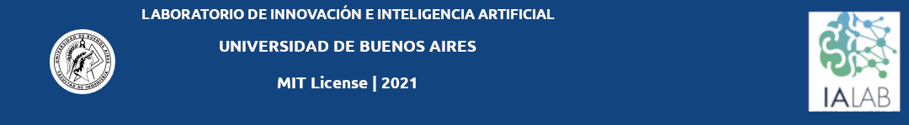

Autor: FS - 2021

# Start coding

Programa de formacion multidisciplinario en ciencia de dato y  programacion,  desarrollado por el Laboratorio en Inteligencia Artifical de la Universidad de Buenos Aires.

En este documento se encontrarán los ejercicios desarrollados durante el proceso de formación.

Este proyecto se encuentra publicado bajo la licencia MIT. En este enlace podrá encontrar más información sobre la misma